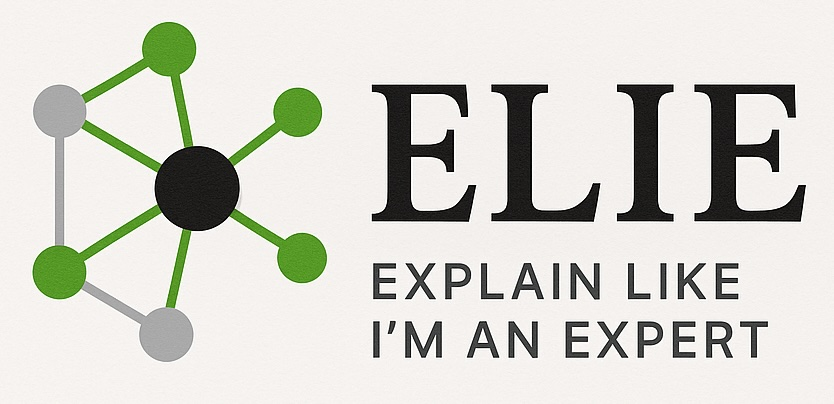

# ELIE


a spin on "Explain Like I'm 5"—but for people who want expert-level nuance.

Check it out at [elie-zii2.onrender.com](https://elie-zii2.onrender.com/) or [try it out locally](#to-run-locally).

ELIE is an interactive [Dash Plotly app](https://dash.plotly.com/) that dynamically tailors explanations to your current knowledge.

## How It Works

1. **Choose a topic:** Enter something you'd like to learn—say, **"quaternions".**
2. **See your baseline:** ELIE delivers an initial explanation plus a concept map (e.g. "complex numbers," "rotation," "linear algebra").
3. **Click unfamiliar nodes:** Select any concept you're not yet comfortable with—e.g. **"complex numbers"**—and ELIE refines the explanation around that prerequisite.
4. **Refine to mastery:** Keep exploring unknown nodes; the map and explanation evolve until they perfectly match your expertise.

## To Run Locally

Clone the repository:
```bash
git clone https://github.com/niksirbi/ELIE.git
cd ELIE
```

Create and activate a conda environment:
```bash
conda create -n elie-env python=3.12
conda activate elie-env
```

Install the package:
```bash
pip install -e .
```

Launch the dash-plotly app:

```bash
python -m elie.app
```

Click on the link in the terminal, e.g. `http://127.0.0.1:8050/` to open the app in your browser.

## About

This is a hackathon project started at the [CompMotifs: Hack the Sciences](https://lu.ma/apsqlxlj?tk=jK3xrw) event in June 2025,
by [Tomáš Hrdlička](https://github.com/tomashrdlicka), [Eva Sevenster](https://github.com/eva-se), and [Niko Sirmpilatze](https://github.com/niksirbi).

> [!warning]
> This is a proof-of-concept project. Feel free to play around with it, but
> keep in mind that it is not production-ready.
